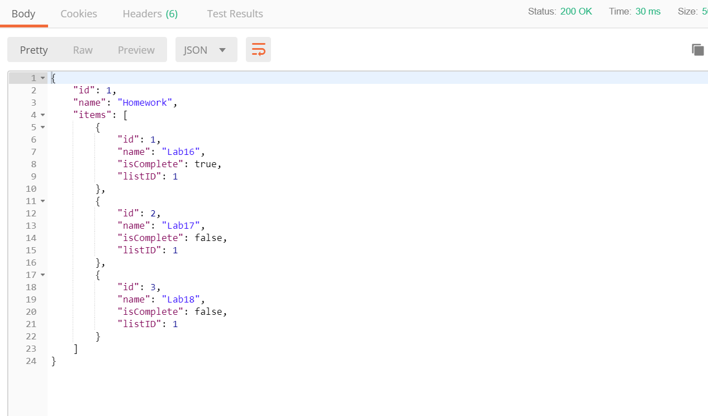

# Lab17_Web_API
First Application Programming Interface (API).

Deployed using Azure: http://mariotodoapi.azurewebsites.net

## About this API
This is a simple To-Do API. While Todo Lists may have many Todo Items, 
each Todo Items can only be in one Todo Lists. 

It has two endpoints
* "/api/todo" -Endpoint for Items
  * GETALL - get all items within the API

  * GETBYID - get one item with the matching id and its associated list
  * POST - add to the API, a todoItem
  * PUT - update one item with matching id
  * DELETE  - delete one item with the matching id

* "/api/todolist" - Endpoint for Lists
  * GETALL - get all Lists within the API
 
  * GETBYID - get one List with the matching id and all its items that are associated
  * POST - add to the API, a todoList
  * PUT - update one List with matching id
  * DELETE  - delete one List with the matching id and all its items 

## Visual

## Other Information
* To utilize this API, please use Postman to do any CRUD operations
* Made with Visual Studio

